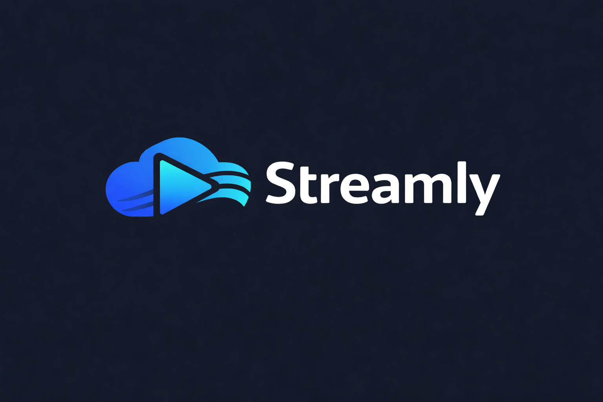
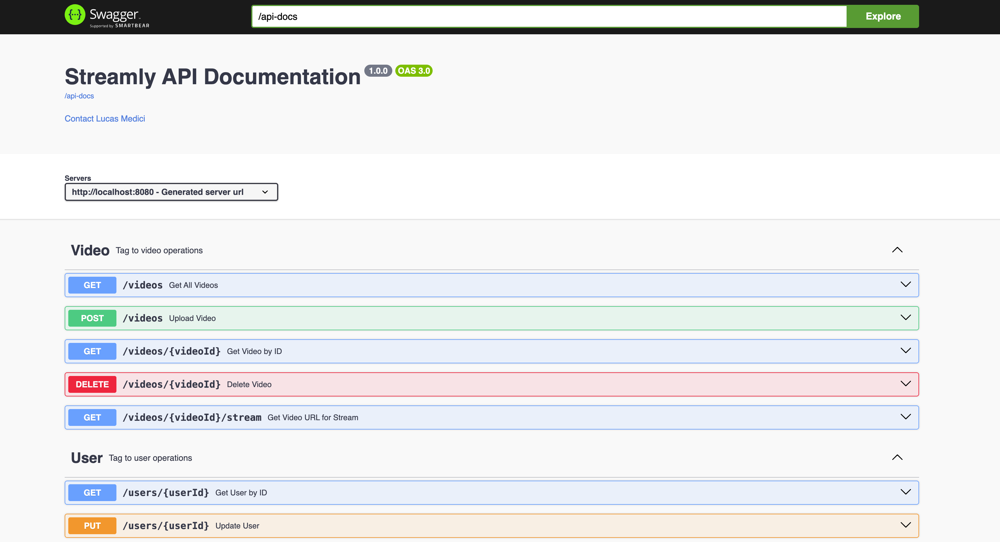
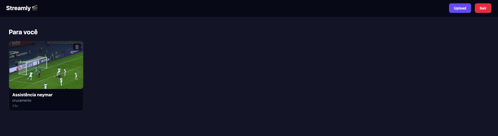
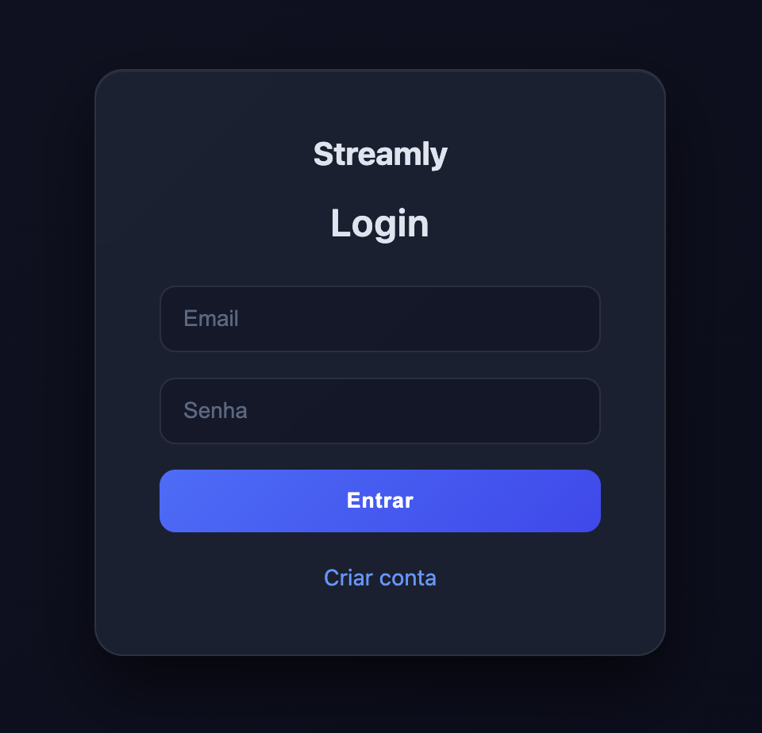
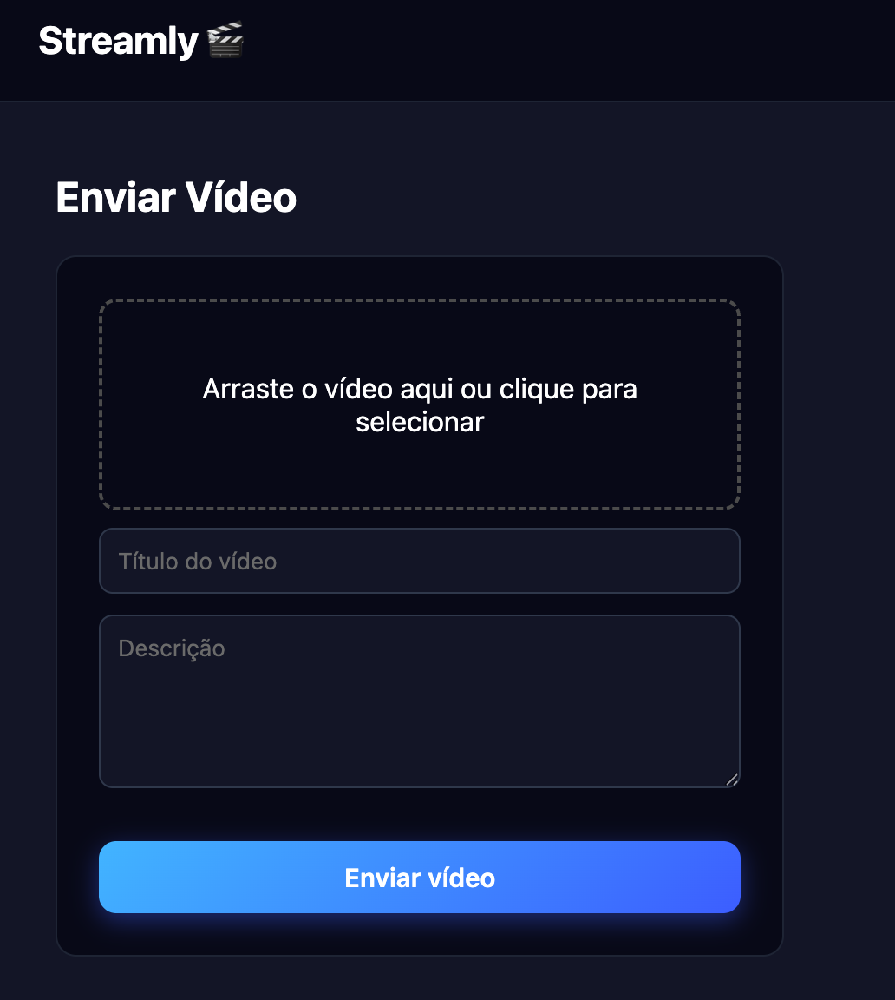
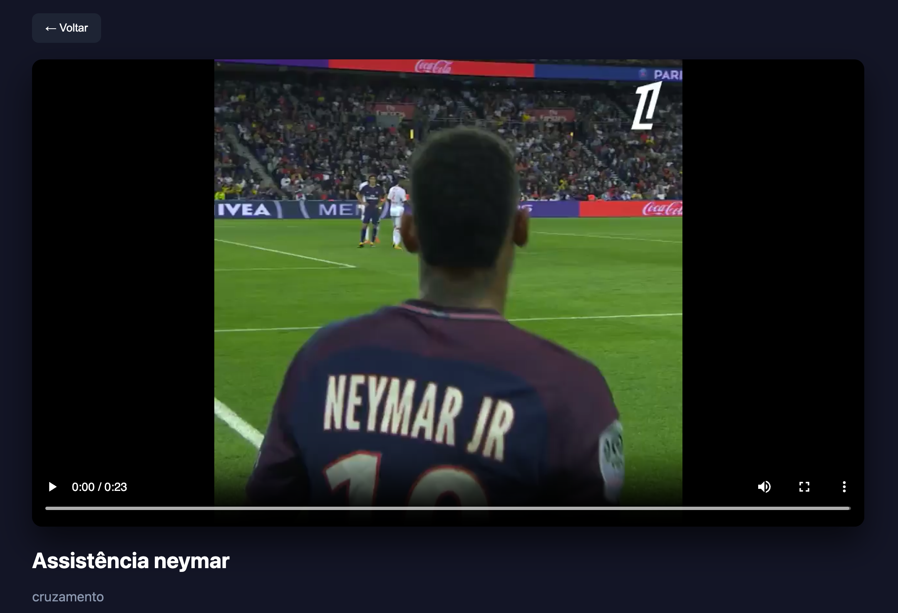

# Streamly - Backend da Plataforma de Streaming de Video

[](https://www.oracle.com/java/)
[](https://spring.io/projects/spring-boot)
[](https://maven.apache.org/)
[](http://localhost:8080/docs)
[](https://www.docker.com/)

<p align="center">
  
</p>

API backend para uma plataforma de streaming de video com autenticacao JWT, gerenciamento de usuarios, processamento assincrono de videos e integracao com Supabase Storage.

## Links Rapidos

- [Visao Geral](#visao-geral)
- [Stack Tecnologica](#stack-tecnologica)
- [Funcionalidades Principais](#funcionalidades-principais)
- [Executar Localmente](#executar-localmente)
- [Executar com Docker](#executar-com-docker)
- [Documentacao da API](#documentacao-da-api)
- [Screenshots da Aplicacao](#screenshots-da-aplicacao)
- [Testes Automatizados](#testes-automatizados)
- [Configuracao](#configuracao)

## Visao Geral

O Streamly e um backend em Spring Boot que suporta upload e fluxo de streaming de videos.
O projeto usa RabbitMQ e FFmpeg para processar videos de forma assincrona (conversao para HLS + geracao de thumbnail), enquanto os metadados ficam no PostgreSQL.

## Stack Tecnologica

- Java 21
- Spring Boot 3
- Spring Web / WebFlux
- Spring Data JPA
- Spring Security (JWT)
- Spring Validation
- Spring AMQP (RabbitMQ)
- PostgreSQL
- Supabase Storage
- FFmpeg / FFprobe
- MapStruct
- Swagger/OpenAPI (springdoc)
- JUnit 5 + Mockito
- Docker + Docker Compose
- Maven

## Funcionalidades Principais

- Login JWT via `POST /auth`
- CRUD de usuarios via `/users`
- Upload de video via multipart `POST /videos`
- Pipeline assincrono de processamento com RabbitMQ
- Geracao de HLS e thumbnail com FFmpeg
- Geracao de URL de stream via `GET /videos/{videoId}/stream`
- Swagger UI em `/docs`

## Estrutura do Projeto

```text
src/main/java/video/streaming/platform/streamly
  auth/
  config/
  exceptions/
  user/
  utils/
  video/
    processing/
  webView/

src/main/resources
  application.properties
  application-dev.properties
  static/
  templates/
```

## Seguranca e Autorizacao

Regras atuais de acesso na configuracao de seguranca:

- Publico: `POST /auth`, `POST /users`, paginas web e rotas do Swagger
- Apenas ADMIN: `POST /videos`, `DELETE /videos/**`
- Demais rotas: autenticadas

O JWT deve ser enviado no header `Authorization` usando `Bearer <token>`.

## Executar Localmente

Pre-requisitos:

- Java 21+
- Maven 3.9+ (ou usar `./mvnw`)
- PostgreSQL
- RabbitMQ
- FFmpeg instalado
- Credenciais do projeto Supabase

Comandos:

```bash
./mvnw clean install
./mvnw spring-boot:run
```

URL padrao da aplicacao:

- `http://localhost:8080`

## Executar com Docker

Este repositorio inclui servicos de backend e RabbitMQ no `docker-compose.yml`.

```bash
./mvnw clean package -DskipTests
docker compose build --no-cache
docker compose up -d
```

URLs/portas uteis:

- API: `http://localhost:8080`
- RabbitMQ Management: `http://localhost:15673`
- RabbitMQ AMQP (host): `localhost:5673`

## Documentacao da API

Com a aplicacao em execucao:

- Swagger UI: `http://localhost:8080/docs`
- OpenAPI JSON: `http://localhost:8080/api-docs`



## Screenshots da Aplicacao

| Home | Login |
| --- | --- |
|  |  |

| Upload | Video |
| --- | --- |
|  |  |

## Testes Automatizados

Executar todos os testes:

```bash
./mvnw test
```

Suite atual inclui:

- `AuthControllerTest`
- `UserServiceTest`
- `VideoControllerTest`
- `VideoServiceTest`
- `JWTUtilTest`
- `GlobalExceptionHandlerTest`
- `StreamlyApplicationTests`

## Configuracao

Principais propriedades usadas pela aplicacao:

- `spring.datasource.url`
- `spring.datasource.username`
- `spring.datasource.password`
- `supabase.url`
- `supabase.service-key`
- `supabase.bucket`
- `spring.rabbitmq.host`
- `spring.rabbitmq.port`
- `spring.rabbitmq.username`
- `spring.rabbitmq.password`
- `spring.rabbitmq.queue-video-name`
- `springdoc.swagger-ui.path`
- `springdoc.api-docs.path`
